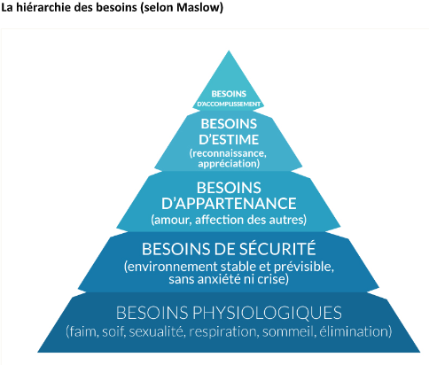
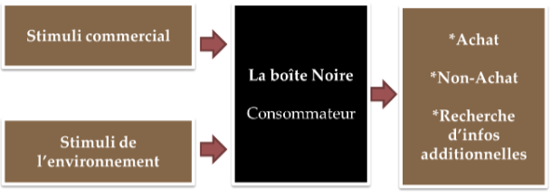
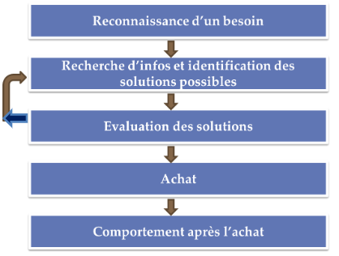

# Comportement du consommateur
### Karel Vilém Svoboda - T.IS-E1A

## Citation
```
« Le comportement du consommateur peut se définir comme étant les actions des personnes qui
participent à l’acquisition et à l’utilisation de biens et services économiques ainsi que les processus
de décision qui précèdent et déterminent les actions. »
```
_Block et Roering, Profl du consommateur_
## Raisons
- Répondre aux attentes du consommateur
- Informer de la sortie du produit

## Sciences humaines:
```Théorie et pistes de réfléxions du comportement humain```
- Psycologie : comportement individuel
- Sociologie : comportement de groupe
- Psyco-sociologie: comportement dans un groupe
- Anthropologie : Société et culture
- Economie : utilisation des ressources limités pour satisfaire ses désirs illimités

## Facteurs individuels influançant l'achat
Économie -> organisation sociale
Objectifs :
- Satisfaction individuelle / collective -> besoin des individus
Économie de marché :
- Entreprise -> bien et service -> satisfaction des besoins
- Objectif entreprise -> profit
  - Détection et satisfaction des besoins -> Combler besoin exprimé ou non en adaptant l'offre

## Facteurs intervennant dans le processeur d'achat du consommateur
Comportement d'achat
- Action réaction/manière d'être/action->situation achat

But :
- Analyse de la méthode (choix et achat) afin de satisfaire ses besoins

Facteurs explicatifs
  - Variable entre les individus
  - Interviennent pendant tout le processus de l'achat
  - Guide le choix de façon conciente/inconsciente

## Les facteurs individuels et socioculturels
Facteurs individuels
- Le sexe.
- L'âge et le cycle de vie (célibataire, en couple, avec ou sans enfants.).
- La profession (agriculteur, profession libérale, profession intermédiaire, ouvrier, employé.).
- Les revenus (faibles, moyens ou hauts.)
- La personnalité (intraverti, extraverti, empathique, agressif…)
- Le concept de soi (image que l'individu a de lui-même, manière dont il pense que les autres
le voient).

Facteurs socioculturels
- L'histoire familiale, les valeurs culturelles (traditions).
- La composition de la famille et le rôle de ses différents membres (achats spécifiques au
mari/à la femme, influence des enfants.).
- Les amis, les collègues de travail, les voisins, les groupes d'appartenance ou de référence
(association, club sportif, groupe politique/religieux.), les réseaux sociaux.
- Les valeurs culturelles sont importantes dans la consommation de produits alimentaires
festifs. Les groupes d'appartenance expliquent la consommation de produits culturels
(musique, littérature.).

## Motivations / Freins
Motivations
- Force -> à satisfaire un besoin
- Raisons -> rationnelles / emotionnelles / physiques / psychologiques
- Hédonisme -> satisfaction personnelle != oblatives -> satisfaction d'autrui != auto expression -> se valoriser

Freins
- Force -> empêche de satisfaire un besoin
- Raisons -> rationnelles / emotionnelles / physiques / psychologiques
- Types -> peurs / risques réels / risques imaginaires -> achat
- Ex -> Achat immobilier -> frein financier car risque trop important -> remboursement

## Le besoin
citation
```
Le besoin est un sentiment de manque éprouvé à l'égard d'une satisfaction générale liée à la condition humaine
```
P. Kotler
 
- Etat, frustration marqué par un manque -> envie de faire disparaitre
  - Central du comportement
  - Déclancheur processur achat
  - Satisfaire besoin -> achat

#### Types de besoin

Physiologiques 
- Exigence de survie
- Innée
- Nourir/vétir/soigner/sécurité (biens et personnes)
- Nombre limité

Psychologiques
- Construite de nature
- Vie sociale
- Épanouissement personnel
- Aquission à un groupe
- Estime de soi
- Accomplissement
- Nombre illimité

#### Satisfaction des besoins
- Investissement personnel
  - Temps / réflexion / argent
- Manque est intense -> plus de frustration -> Plus grand investissement de l'individu



## Influances et stimuli
Facteurs déclancheurs de l'action d'achat


#### Types de stimuli

Commercial
- Provient -> entreprise qui la contrôle
- Piblicité, Prix, Packing, Promotion, Distribution,... (Marketing Mix)

Environnement
- Non contrôlé par l'entreprise
- Concurrence, Tabous sociaux, Lois, Climat

#### Consommateur
Types de dimensions

Interseque
- Motivation, Perceprtion, Apprentissage, Attitude, Personnalité

Extrinseque
- Culture, Classes sociales, Groupes de références, Famille

## Les facteurs situationnels
- Situation d'achat
- Éléments matériels et humains
- Indépendant de l'individu
- Contexte
- Période de l'année (vacances, fêtes, soldes)
- Facteurs d'ambiance (éclairage, musique, décor)
- Attitude du vendeur(compétence, amabilité, disponibilité)
- Influance sur le comportement du consommateur

## Le processus d'achat
- Recouvre les étapes qui conduisent un consommateur à choisir un bien ou un service
#### Les étapes du processus


#### 1. L'émergence du besoin
- Débute -> existance besoin
- Ecart -> situation présente / situation désirée
  - Combler : **acte d'achat -> stimuli -> pousser à l'achat**

- Stimuli
  - Interne
    - Individus (psychologie, santé, besoins primaires) -> Pyramide de Maslow
    - Externe (entourage, famille, message publicitaire très pertinent)

#### 2. La recherche d'information et de solutions possibles
- détails techiques, possibilités, choix, options

Décision de satisfaire un besoin (achat) -> Recherche d'option possibles

Types de recherches
- Interne
  - mémoire et expériences passées
- Externe
  - consultation avec environnement direct (famille)
  - environnement indirect
    - Information sur le lieu de vente
    - Sites internet
    - Réseaux sociaux
    - Le bouche à oreille

Les informations externes des proches sont les plus rassurantes
Le crédit de la source -> important

#### 3. L'évaluation des solutions: comparaison des solutions d'achat
Informations collectés phase de recherche -> developpment du jugement du consommateur
  - Evaluation des différentes solutions par attribut

Préférences personnelles
  - Filtre pour choisir produit et service les plus adéquat aux attentes objectives / subjectives, Concientes / Inconcientes
  - Questions d'image -> important dans l'expression des préférences

Autres facteurs
  - Peuvent avoir un impact sur la short liste finale (liste réduite)
  - Interne / Externe
  - Ex : mauvaise expérience avec un vendeur -> non achat su produit malgrès ses qualités

#### 4. La décision d'achat
Le consommateur détient tous les éléments pour faire son choix

Il fera son choix définitif en fonction
  - hiérarchisation de ses critères
  - élément de dernière minute
    - Ex : Promo "flash"
  - Si achat important -> plus de facteurs
    - Ex : Les risques encourus
  - Recommendations et expériences de son entourage

#### 5. L'évolution post-achat
- Satisfaction ou mécontentement
- Recommandations à des tiers
- Critiques

- Fait partie du processus d'achat
  - La satisfaction est le l'élément le plus important
    - Satisfaction -> différence entre l'attente et l'apport du produit
    - Bonne satisfaction -> fidélité et réputation
    - Réputation / L'image de l'entreprise
      - Grande influance des réseaux sociaux
      - Importante à soigner

## La variablitié du processus d'achat

Chaque situation d'achat est uniques

La durée des étapes du processus d'achat varie en fonction des critères suivants


#### 1.Types d'achat
Réfléchi -> Processus long
Routinier -> Décision rapide, se fonde sur l'expérience du consommateur avec peu de recherche
Impulsif-> Processus court. La décision émotive, favorisé par les facteurs situationnels

#### 2.Les enjeux liés au produit
Risques importants -> risques plus longs
  - Coûts financiers
  - Peur de l'erreur
  - Forte émoitivitée

#### 3. L'individu acheteur
Influance des facteurs explicatifs -> varie selon les individus

Ex : Achat immobilier -> risque perçu élevé.
Le choix du bien sera différent en fonction en fonction du type de contrat 
  - Achat résidence principale / secondaire, bail ou achat etc.